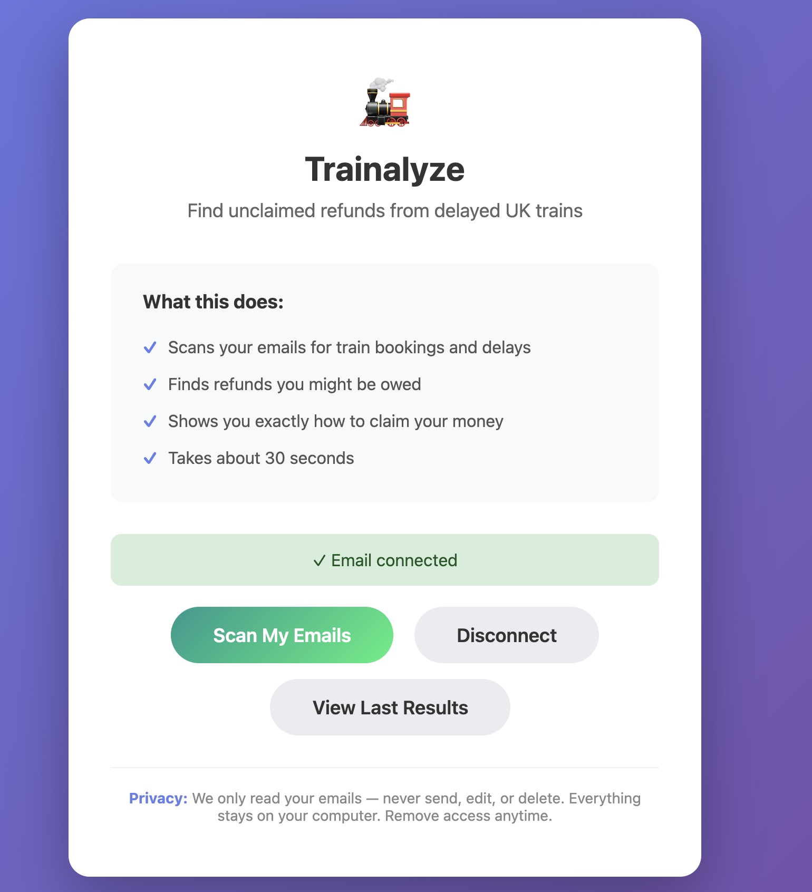
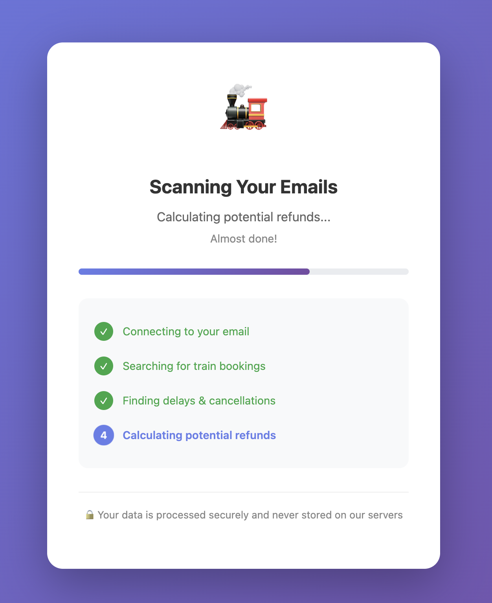
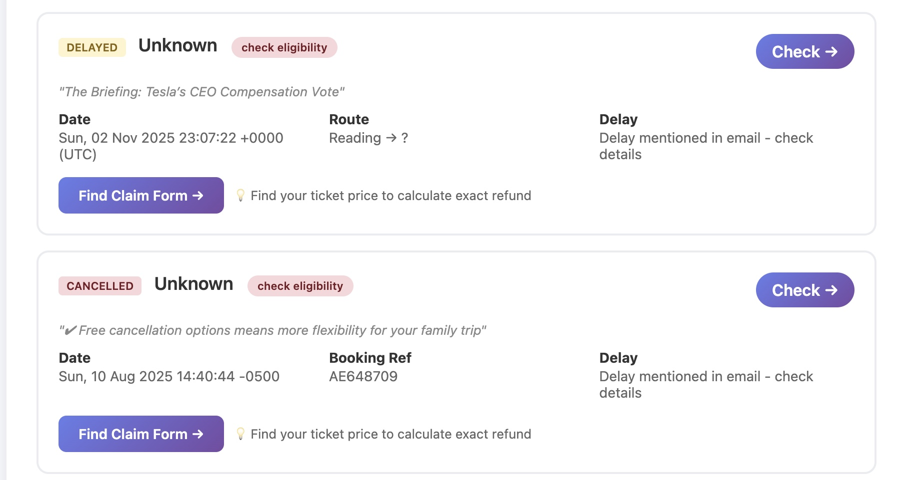
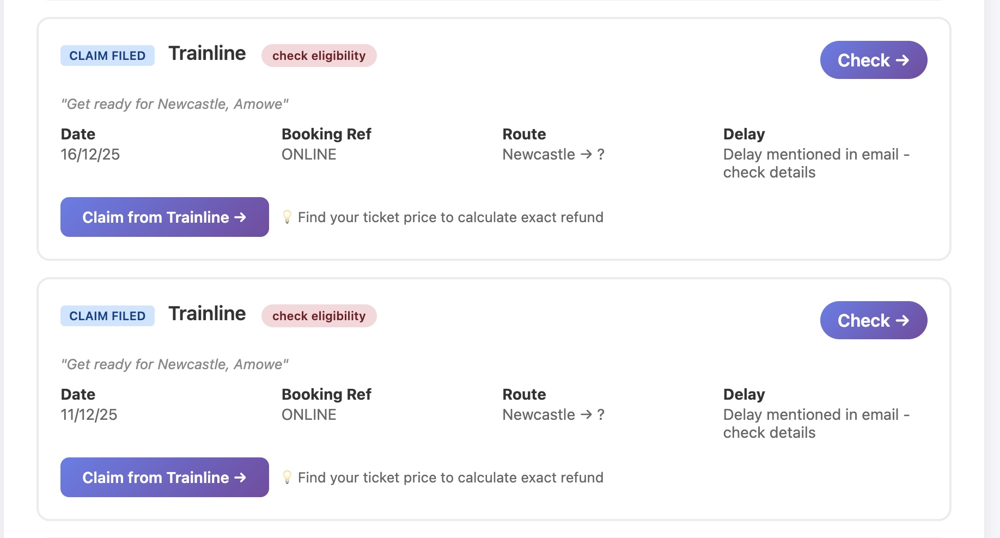

# Trainalyze Web

A simple web app to find unclaimed train refunds from your emails.

Deployed here https://trainalyzeweb.onrender.com/

## Screenshots

  
  
  
  
  
  

## What You'll See

1. **Connect** - Sign in with your email account
2. **Scan** - We look through your transport emails (takes ~30 seconds)
3. **Results** - See potential refunds with direct claim links
